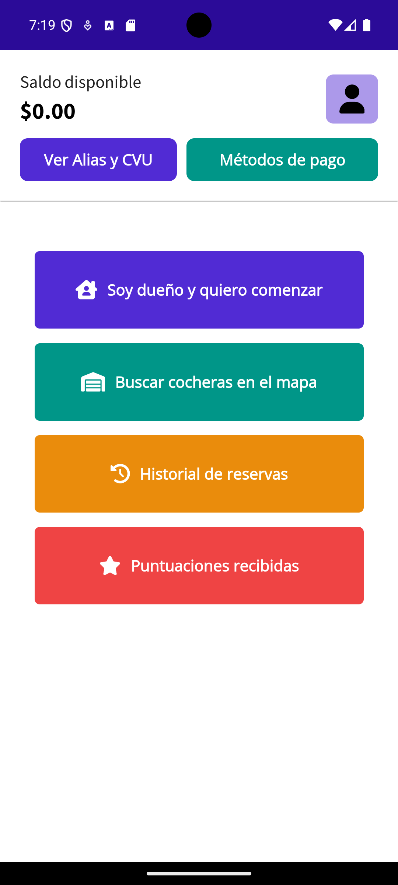
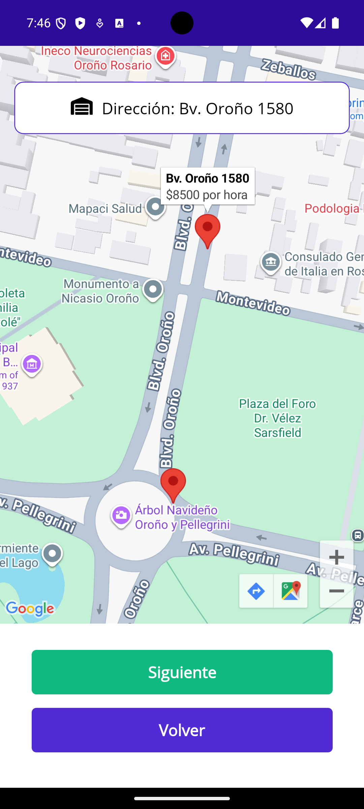

# Garage Booking Demo (.NET MAUI + ASP.NET Core)

A mobile demo application built with .NET MAUI and ASP.NET Core that demonstrates a complete parking reservation flow: login, browse available garages, and book a spot.

This project was built as a simplified demo derived from a larger real-world parking management system.

## Features

- User authentication (login)
- View available garages
- Select a garage
- Complete booking flow
- Simulated reservation confirmation

## Demo Focus

This demo demonstrates a complete client-side booking flow and a clean separation between mobile app and backend API.

## Tech Stack

**Frontend**
- .NET MAUI
- MVVM (CommunityToolkit.Mvvm)

**Backend**
- ASP.NET Core Web API
- Dependency Injection
- In-memory data store

**Shared**
- DTOs shared between client and API

## Architecture

The solution is organized into three main projects:

- `Demo.Api` – REST API
- `Demo.Maui` – Mobile application
- `Demo.Shared` – Shared DTOs and models

This separation ensures a clean layered architecture between client, server, and shared contracts.

## Architecture Highlights

- Clean separation between UI, services, and API layers
- MVVM pattern using CommunityToolkit.Mvvm
- API consumption via HttpClient with dependency injection

## Prerequisites

- **.NET 9** SDK
- **.NET MAUI** workload (for building/running the mobile project)
- For **Android**: Android SDK / emulator or device

## Demo Credentials

Use the client account for the intended booking flow.

DNI: 12341234  
Password: Demo1234

## How to run the demo (API + Android)

1. **Start the API** (from the repository root):

   ```bash
   dotnet run --project Demo/Demo.Api/Demo.Api.csproj
   ```

   Default **HTTP** URL in this repo: `http://localhost:5113` (see `Demo/Demo.Api/Properties/launchSettings.json`).

2. **Run the MAUI app on Android** (the app uses `10.0.2.2` to reach the host from the Android emulator, configured in `Demo/Demo.Maui/MauiProgram.cs`):

   ```bash
   dotnet build Demo/Demo.Maui/Demo.Maui.csproj -f net9.0-android
   ```

   Deploy to your **Android** target from your IDE or CLI.

3. **Order of operations** – Start the API so login and map calls succeed when the app loads those screens.

**Non-Android:** The MAUI project may use `http://localhost:5113/` for non-Android platforms in `MauiProgram.cs`. This document focuses on the **Android** path used for the local demo.

## Notes

- Google Maps requires a valid API key (Maps SDK for Android) configured in `AndroidManifest.xml` to display the map correctly
- Uses in-memory data (no database)
- Reservation confirmation is simulated
- Some features are simplified for demo purposes

## Screenshots

Initial steps of the booking flow:

<table align="center">
  <tr>
    <td align="center">
      <strong>Home</strong><br/>
      
    </td>
    <td align="center">
      <strong>Map - Selecting a garage</strong><br/>
      
    </td>
  </tr>
</table>
